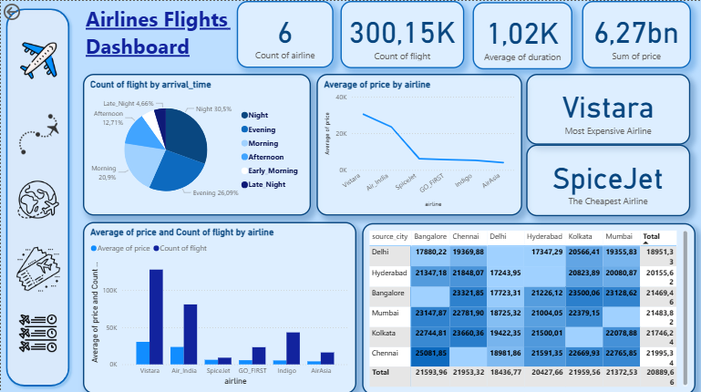

# 🛫 Airlines Flights Dashboard

This project provides an **Airlines Flights Analysis Dashboard** designed to visualize key performance metrics, trends, and insights related to flight data.
The dashboard is **interactive, simple, and user-friendly**, enabling users to monitor and analyze airline performance effectively.


## 

<p align="center">
  
</p>  


## ✨ Features

### 🔑 Key Metrics Overview

Displays essential KPIs such as:

* **Count of Airlines** → 6
* **Count of Flights** → 300.15K
* **Average Flight Duration** → 1.02K minutes
* **Sum of Price** → 6.27bn

---

### ⏰ Flights by Arrival Time

A pie chart showing flight distribution across different times of the day:

* Night → 30.5%
* Evening → 26.09%
* Morning → 20.9%
* Afternoon → 12.71%
* Early Morning → 5.14%
* Late Night → 4.66%

---

### 💰 Average Price by Airline

* A line chart comparing airlines based on ticket prices
* **Vistara** → Most expensive airline
* **SpiceJet** → Cheapest airline

---

### 📊 Price & Flight Count by Airline

A bar chart presenting both average price and flight count across airlines:

* Vistara
* Air India
* SpiceJet
* GO\_FIRST
* Indigo
* AirAsia

---

### 🌍 Price by Source & Destination Cities

* A heatmap table showing ticket prices across source cities:
  **Delhi, Hyderabad, Bangalore, Mumbai, Kolkata, Chennai**
* Provides insights into which city pairs have the **highest and lowest ticket prices**

---

## 🛠 Technologies Used

* **Microsoft Power BI** → For building the dashboard and visualizations
* **DAX (Data Analysis Expressions)** → For calculated metrics (average, sum, KPIs)
* **Excel/CSV Dataset** → Source data for flights and airlines

---

## ⚙️ Installation and Usage

### ✅ Prerequisites

* Install **Power BI Desktop**
* Access to the **flights dataset**

### 📥 Steps

```bash
# Clone the repository
git clone https://github.com/NazrinInsight/Airlines_Flights_Dashboard.git
```

* Open the `.pbix` file in **Power BI Desktop**
* Load the dataset if required
* Explore and interact with the dashboard 🚀

---

## 
👩‍💻 **Nazrin Kocharli**

---

