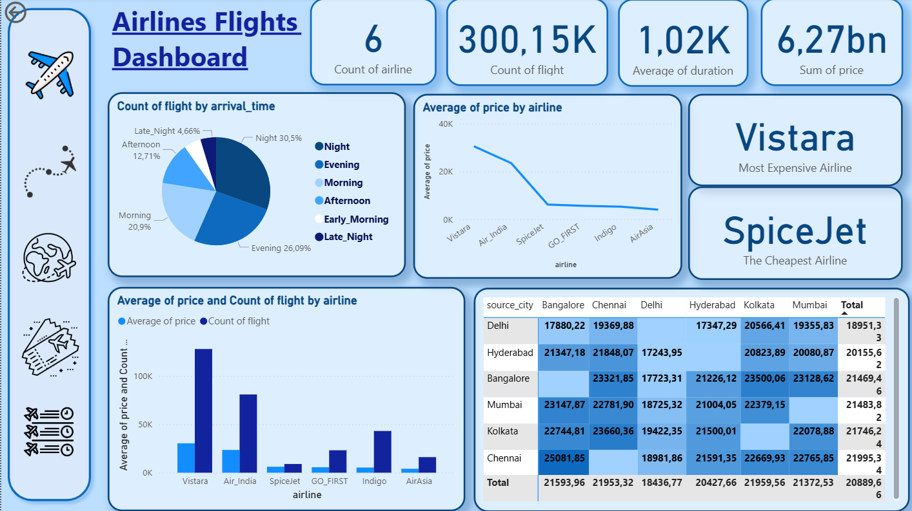

🛫 Airlines Flights Dashboard
This project provides an Airlines Flights Analysis Dashboard designed to visualize key performance metrics, trends, and insights related to flight data.
The dashboard is interactive, simple and user-friendly, enabling users to monitor and analyze airline performance effectively.
📸 Dashboard Screenshot

  

✨ Features
🔑 Key Metrics Overview
Displays essential KPIs such as:
Count of Airlines → 6
Count of Flights → 300.15K
Average Flight Duration → 1.02K minutes
Sum of Price → 6.27bn
⏰ Flights by Arrival Time
A pie chart showing flights distribution across different times of the day:
Night (30.5%)
Evening (26.09%)
Morning (20.9%)
Afternoon (12.71%)
Early Morning (5.14%)
Late Night (4.66%)
💰 Average Price by Airline
A line chart comparing airlines based on ticket prices.
Vistara → Most expensive airline
SpiceJet → Cheapest airline
📊 Price & Flight Count by Airline
A bar chart presenting both average price and flight count across airlines (Vistara, Air India, SpiceJet, GO_FIRST, Indigo, AirAsia).
🌍 Price by Source & Destination Cities
A heatmap table showing ticket prices across different source cities (Delhi, Hyderabad, Bangalore, Mumbai, Kolkata, Chennai).
Provides insights into which city pairs have the highest and lowest prices.
🛠 Technologies Used
Microsoft Power BI → For building the dashboard and visualizations
DAX (Data Analysis Expressions) → For calculated metrics (average, sum, KPIs)
Excel/CSV Dataset → Source data for flights and airlines
⚙️ Installation and Usage
✅ Prerequisites
Install Power BI Desktop
Access to the flights dataset
📥 Steps
# Clone the repository
git clone https://github.com/NazrinInsight/Airlines_Flights_Dashboard.git
Open the .pbix file in Power BI Desktop

Load the dataset if required

Explore and interact with the dashboard 🚀

📌 Author

👩‍💻 Created by Your Name
